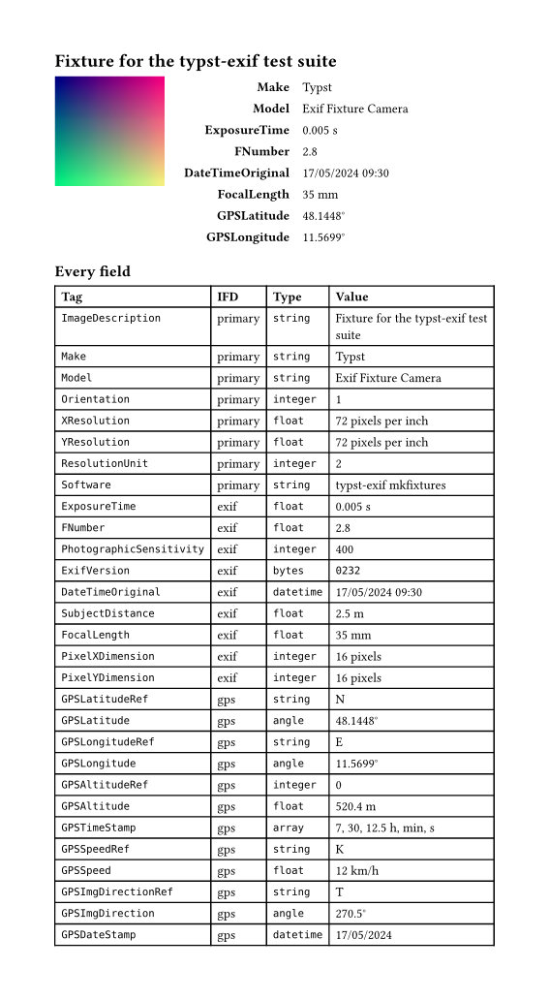

# exiftract

Read Exif metadata from images: camera, exposure, date, GPS position. Values
come back as Typst types, so a date is a `datetime` and a coordinate is an
`angle`.

Parsing runs in a WebAssembly plugin. There is nothing to install, and it
behaves the same in the web app, the CLI and CI.

```typst
#import "@preview/exiftract:0.1.0": read-exif

#let fields = read-exif(read("photo.jpg", encoding: none))
#let by-tag = fields.map(f => (f.tag, f.value)).to-dict()

#by-tag.Model                       // "Exif Fixture Camera"
#by-tag.ExposureTime                // 0.005
#by-tag.DateTimeOriginal.display()  // "2024-05-17 09:30:00"
#by-tag.GPSLatitude.deg()           // 48.1448
```

Requires Typst 0.15.



## `read-exif`

```typst
read-exif(
  data,
  return-raw: false,
  fallback: auto,
  max-values: 64,
  keep-partial: true,
) -> array
```

Returns the fields in the order the file stores them, one dictionary each:

```typst
(
  tag: "ExposureTime",  // tag name, or "exif-0x9999" if unknown
  ifd: "exif",          // primary, thumbnail, exif, gps or interop
  number: 33434,        // numeric tag id
  type: "rational",     // Exif type, as stored
  count: 1,             // elements, before truncation
  value: 0.005,         // value, as a Typst type
  unit: "s",            // unit, or none
)
```

| Argument | Type | |
| --- | --- | --- |
| `data` | `bytes` | The image file: `read("photo.jpg", encoding: none)`. |
| `return-raw` | `bool` | Skip interpretation, see [below](#return-raw). |
| `fallback` | any | Returned instead of failing when the file is not a readable image. At `auto`, that case panics. Returned as given. |
| `max-values` | `int` | Elements kept per field. |
| `keep-partial` | `bool` | Keep the fields that parsed from a damaged block. At `false`, any damage is an error. |

Reads JPEG, TIFF (including TIFF-based raw formats), PNG, WebP and
HEIF/HEIC/AVIF.

Pass bytes, not a path. Typst resolves relative paths against the file they
appear in, so `read-exif("photo.jpg")` would look next to the package's own
source; it is rejected with a hint.

## Values

| Exif | becomes | example |
| --- | --- | --- |
| rational | `float` | `ExposureTime` `(1, 200)` → `0.005` |
| `DateTime`, `DateTimeOriginal`, `DateTimeDigitized` | `datetime` | `"2024:05:17 09:30:00"` |
| `GPSDateStamp` | `datetime`, date only | `"2024:05:17"` |
| `GPSLatitude`, `GPSLongitude`, `GPSDestLatitude`, `GPSDestLongitude` | `angle` | `(48, 8, 41.23)` → `48.1448deg` |
| `GPSTrack`, `GPSImgDirection`, `GPSDestBearing`, `CameraElevationAngle` | `angle` | `270.5deg` |
| `UNDEFINED` | `bytes` | `ExifVersion`, `str()` gives `"0232"` |
| integers, ASCII | unchanged | already native |

Single-element fields, which is nearly all of them, are unwrapped to a bare
value; multi-valued ones stay arrays. `count` gives the true length either way,
including when `max-values` truncated it. Raise `max-values` for `MakerNote`
and `UserComment`, which run to tens of kilobytes.

Coordinates carry their hemisphere: `GPSLatitudeRef` `"S"` and
`GPSLongitudeRef` `"W"` produce a negative angle, and `GPSAltitude` is negative
below sea level. Reference fields are read from the same image directory, so a
thumbnail's do not affect the primary image's.

## Units

`unit` is a string, or `none` if the value is dimensionless or its Typst type
already implies the unit.

```typst
#let field = fields.find(f => f.tag == "FocalLength")
#field.value  // 35.0
#field.unit   // "mm"
```

Units come from the Exif specification. Most are fixed by tag (`"s"`, `"mm"`,
`"m"`, `"EV"`, `"pixels"`, `"hPa"`). Four are named by another field, which
`read-exif` resolves:

| Tag | unit from | example |
| --- | --- | --- |
| `XResolution`, `YResolution` | `ResolutionUnit` | `"pixels per inch"` |
| `FocalPlaneXResolution`, `FocalPlaneYResolution` | `FocalPlaneResolutionUnit` | `"pixels per cm"` |
| `GPSSpeed` | `GPSSpeedRef` | `"km/h"` |
| `GPSDestDistance` | `GPSDestDistanceRef` | `"nautical miles"` |

## Not converted

Three kinds of value stay numbers, because converting them would work on some
files and not others.

- **Lengths.** Typst's `length` has no metre, but `SubjectDistance` is in
  metres, so `FocalLength` would convert and it would not. A `length` is also a
  layout dimension rather than a physical quantity: `35mm` is `99.21pt`.
- **`GPSTimeStamp`.** Its seconds are routinely fractional, and both `datetime`
  and `duration` take whole seconds. It stays `(7.0, 30.0, 12.5)` with
  `unit: "h, min, s"`.
- **Enumerations.** `Orientation` is `1`, `Flash` is a bit field. Decoding them
  is presentation.

## Damaged values

Reading does not fail on a broken file.

- `0/0`, which Exif uses for "unknown", becomes `float.nan`. Test it with
  `float.is-nan(value)`, not `==`.
- Dates that are blank, malformed, or impossible (February 30th occurs in real
  files) stay strings. Check `type(value) == datetime` before formatting.
- Unknown tags pass through unchanged, with `unit: none`.

`GPSDateStamp` has no time of day, so `display()` with an `[hour]` in the
format string fails on it; `value.hour() == none` distinguishes the two.
Sub-second digits and UTC offsets stay in their own fields
(`SubSecTimeOriginal`, `OffsetTimeOriginal`), because `datetime` cannot hold
them.

## `return-raw`

`return-raw: true` returns what the file holds. Rationals stay
`(numerator, denominator)` pairs, dates stay strings, `UNDEFINED` stays a list
of byte values, and there is no `unit`. The other members are unchanged.

```typst
#read-exif(photo).find(f => f.tag == "ExposureTime").value
// 0.005

#read-exif(photo, return-raw: true).find(f => f.tag == "ExposureTime").value
// (1, 200)
```

## Looking up fields

The result is a plain array:

```typst
#fields.find(f => f.tag == "Model").value
#fields.filter(f => f.ifd == "gps")
```

Unknown tags are keyed by context and number, like `tiff-0x9999`. An image and
its embedded thumbnail can carry the same tag; both are kept, told apart by
`ifd`. A dictionary built with `to-dict()` keeps the last of them.

## No Exif data

An image with no Exif block — a screenshot, an export that stripped its
metadata — is not an error. There is no metadata, and `()` says so:

```typst
#let fields = read-exif(read("screenshot.png", encoding: none))
#if fields == () [No metadata.]
```

A file that is not a readable image is a different matter, and does panic:

```typst
#read-exif(read("notes.pdf", encoding: none))
// error: could not read Exif metadata: Unknown image format
```

So does an Exif block too damaged to salvage — a mangled header, say, which
`keep-partial` cannot work around. Typst has no way to catch a panic, so
`fallback` stands in for one when a stray file must not stop the document:

```typst
#let fields = read-exif(read(path, encoding: none), fallback: ())
```

Reach for it when the paths come from data you do not control. Left at `auto`,
an unreadable file stays loud, which is usually what you want while writing.

## Example

[`examples/metadata.typ`](examples/metadata.typ) is the document pictured
above: the photo, a summary table, and every field found.

## Building

The Rust source, tests and build tooling are in the [repository][repo].
`exif.wasm` is committed, so no Rust toolchain is needed to use the package.
To rebuild it:

```sh
rustup target add wasm32-unknown-unknown
make            # refresh exif.wasm
make test       # Rust tests, both Typst suites, the staged package
make dist       # stage the package for submission
```

Test images are generated by `plugin/examples/mkfixtures.rs` rather than
committed as photographs, so the metadata under test is explicit.

## License

The Typst sources are MIT, see [LICENSE](LICENSE).

`exif.wasm` also contains the Rust crates it was compiled from, chiefly
[kamadak-exif], which is BSD-2-Clause. Their notices are in
[NOTICE.md](NOTICE.md), and the manifest declares the combination as
`MIT AND BSD-2-Clause`.

[kamadak-exif]: https://github.com/kamadak/exif-rs
[repo]: https://github.com/Uspfe/typst-exiftract
